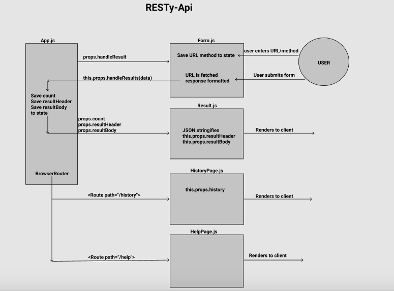

# RESTy-api

#### Author: Riva Davidowski

### Project Overview: A create-react-website that displays results from API call

**Phase 1:** My goal is to setup the basic scaffolding of the application, with intent being to add more functionality to the system as I go. This initial build sets up the file structure so that I can progressively build this application in a scalable manner.

This first phase involves entering the URL to a REST API and selecting the REST method to use to access it. Providing a visual confirmation that  entries and selections are valid is another goal so I know that the application will be able to fetch the API data that I’ve requested.

**Phase 2:** In phase 2, I connect RESTy-api to live APIs, fetching and displaying remote data. The primary focus will be to service GET requests. Deploying the application to GitHub pages using a GitHub action which will publish the “build” to the gh-pages branch of my repository on all check-ins is the last part of phase 2.

**Phase 3:** In this phase of the RESTy build, I add some more fidelity to the application, including a menu, history, and an “in-progress” spinner. In this phase, I can use all REST methods so that I can do more than just get data and see a “loading” indicator while RESTy is fetching data so that I know it’s working on my request.

**Phase 4:** In this final phase of the RESTy build, I add some more fidelity to the application, including a menu with a more detailed view of history, as well as an about us page. Using React's `BrowserRouter` libary, I am able to conditionally show child components based on the browser route.

#### Usability: To use RESTy-Api, clone the repo and do an `npm i`. This will install `create-react-app` and all other dependencies needed for the project to run. As listed below, to start the app, run `npm start ` in the project directory.

**Getting Started with Create React App**

- This project was bootstrapped with [Create React App](https://github.com/facebook/create-react-app). The entry point for this application is `App.js`.

- To create a React application, run `npx create-react-app (name of project here, all lowercase)`
- To install it globally, run `npm install -g create-react-app`

**Additional Dependencies used:**
- Install node sass, run `npm i --save node-sass@4`
- Install react-bootstrap for spinner: `npm i --save react-bootstrap bootstrap`
    - On `App.js` or `Index.js` import bootstrap: `import * as ReactBootStrap from 'react-bootstrap';`
    - On `Index.html` add the script tag: 
    - 
      `<link
    rel="stylesheet"
    href="https://maxcdn.bootstrapcdn.com/bootstrap/4.5.0/css/bootstrap.min.css"
    integrity="sha384-9aIt2nRpC12Uk9gS9baDl411NQApFmC26EwAOH8WgZl5MYYxFfc+NcPb1dKGj7Sk"
    crossorigin="anonymous"
  />`

- Install react-router-dom, run `npm i --save react-router-dom`
- Import the Browser Router object:
- 
`import {
  BrowserRouter as Router,
  Switch,
  Route,
  Link
} from "react-router-dom"`;

## Available Scripts

In the project directory, you can run:

### `npm start`

Runs the app in the development mode.\
Open [http://localhost:3000](http://localhost:3000) to view it in the browser.

The page will reload if you make edits.\
You will also see any lint errors in the console.

### `npm test`

Launches the test runner in the interactive watch mode.\
See the section about [running tests](https://facebook.github.io/create-react-app/docs/running-tests) for more information.

**UML:**

