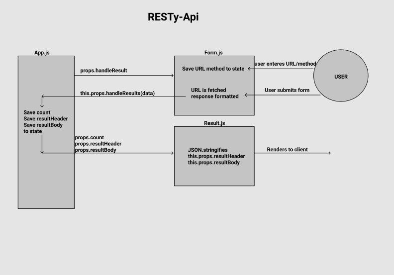

# RESTy-api

#### Author: Riva Davidowski

### Project Overview:

**Phase 1:** My goal is to setup the basic scaffolding of the application, with intent being to add more functionality to the system as I go. This initial build sets up the file structure so that I can progressively build this application in a scalable manner.**

This first phase involves entering the URL to a REST API and selecting the REST method to use to access it. Providing a visual confirmation that  entries and selections are valid is another goal so I know that the application will be able to fetch the API data that I’ve requested.

**Phase 2:** In phase 2, I connect RESTy-api to live APIs, fetching and displaying remote data. The primary focus will be to service GET requests. Deploying the application to GitHub pages using a GitHub action which will publish the “build” to the gh-pages branch of your repository on all check-ins is the last part of phase 2.

#### Usability: 

**Getting Started with Create React App**

- This project was bootstrapped with [Create React App](https://github.com/facebook/create-react-app). The entry point for this application is `App.js`.

- To create a React application, run `npx create-react-app (name of project here, all lowercase)`
- To install it globally, run `npm install -g create-react-app`

**Additional Dependencies used:**
- Install node sass, run `npm i --save node-sass@4`

## Available Scripts

In the project directory, you can run:

### `npm start`

Runs the app in the development mode.\
Open [http://localhost:3000](http://localhost:3000) to view it in the browser.

The page will reload if you make edits.\
You will also see any lint errors in the console.

### `npm test`

Launches the test runner in the interactive watch mode.\
See the section about [running tests](https://facebook.github.io/create-react-app/docs/running-tests) for more information.

#### UML:

